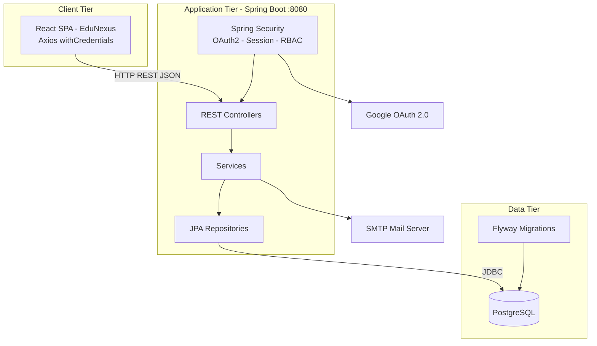
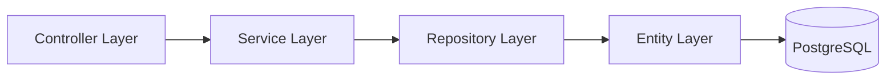

# Smart Campus Platform — Facility Booking & Campus Operations

**SLIIT | Programming Application Framework (PAF) — Assignment 2026**  
**Repository:** [https://github.com/Sthulnith/smart-campus](https://github.com/Sthulnith/smart-campus)

---

## Table of Contents

1. [Project Description](#project-description)
2. [Business Scenario](#business-scenario)
3. [Features Implemented](#features-implemented)
4. [Technologies Used](#technologies-used)
5. [System Architecture Overview](#system-architecture-overview)
6. [Project Structure](#project-structure)
7. [Setup Instructions](#setup-instructions)
8. [Database Configuration](#database-configuration)
9. [API Endpoint Summary](#api-endpoint-summary)
10. [OAuth Authentication Flow](#oauth-authentication-flow)
11. [GitHub Actions / CI Workflow](#github-actions--ci-workflow)
12. [Team Members and Contributions](#team-members-and-contributions)
13. [Project Demonstration](#project-demonstration)
14. [Application Demo Screenshots](#application-demo-screenshots)
15. [Postman API Testing Evidence](#postman-api-testing-evidence)
16. [Database Validation Evidence](#database-validation-evidence)
17. [System Demonstration Summary](#system-demonstration-summary)
18. [Documentation](#documentation)
19. [Future Improvements](#future-improvements)
20. [References](#references)
21. [License](#license)

---

## Project Description

**Smart Campus** (frontend brand: **EduNexus**) is a full-stack web application designed to digitize core campus operations at a higher-education institution. The system centralizes **facility/resource management**, **room and equipment booking**, **IT/maintenance support ticketing**, and **role-targeted campus notifications** behind a single secure portal.

The solution follows a **monorepo architecture** with a **Spring Boot REST API** (`backend/`) and a **React single-page application** (`frontend/`). Authentication supports **Google OAuth 2.0** and **local email/password** accounts with **session-based security**, **role-based access control (RBAC)**, and **password reset** via email (or demo-mode console link).

---

## Business Scenario

Universities manage shared facilities (lecture halls, labs, meeting rooms, equipment) and receive maintenance requests from students and staff daily. Manual booking spreadsheets and informal ticket channels lead to **double bookings**, **delayed approvals**, and **poor visibility** for administrators and technicians.

**Smart Campus** addresses this by providing:

| Stakeholder | Problem | System Solution |
|-------------|---------|-----------------|
| **Student / Staff** | Difficulty reserving facilities | Self-service booking with conflict detection and status tracking |
| **Administrator** | No central view of bookings and users | Admin dashboards, booking approval/rejection, facility CRUD, user/role management |
| **Technician** | Unclear work assignments | Assigned ticket queue with status updates and resolution notes |
| **Campus Admin** | Broadcast announcements | Role-targeted notifications with per-user category preferences |

---

## Features Implemented

### Authentication & Security
- Google OAuth 2.0 sign-in (`/oauth2/authorization/google`)
- Local registration (`/api/auth/signup`, `/api/auth/register`)
- Email/password sign-in with session persistence (`/api/auth/signin`)
- Current user profile endpoint (`GET /api/auth/me`)
- Profile update for eligible roles (`PUT /api/auth/me`)
- Password reset request and token-based reset (`/api/auth/forgot-password`, `/api/auth/reset-password`)
- Sign-in and forgot-password **rate throttling**
- Session logout (`POST /api/auth/logout`)
- Optional demo user seeding (`APP_SEED_DEMO_USERS=true`)

### Facility (Resource) Management
- List and view campus facilities/resources
- Admin-only create, update, and delete resources

### Booking Management
- Users create bookings linked to resources with date/time, purpose, attendees, campus, category, and floor
- Automatic **time-slot conflict detection** on create
- Booking statuses: `PENDING`, `APPROVED`, `REJECTED`, `CANCELLED`
- Admin approve/reject bookings; users/admins cancel bookings
- Admin views all bookings; users view own bookings
- Booking analysis page (frontend route `/booking-analysis`)

### Support Ticketing
- Users create support tickets (category, priority, description, location, optional images)
- Ticket statuses with validated transitions: `OPEN` → `IN_PROGRESS` → `RESOLVED` → `CLOSED`, or `REJECTED`
- Admin assigns technicians; assignment moves ticket to `IN_PROGRESS`
- Technicians view assigned tickets and update status with resolution notes
- Ticket comments (list, add, edit own, delete own or admin)
- Image upload on tickets (max 3 files; JPG/JPEG/PNG)

### Notifications
- Admin creates/updates/deletes campus notifications by target role
- Categories: `BOOKING`, `MAINTENANCE`, `ANNOUNCEMENT`, `RESOURCE`, `GENERAL`
- Users view notifications filtered by role and **personal category preferences**
- Users update notification preference toggles per category

### Administration
- Admin lists all users and assignable technicians
- Admin updates user roles (`ROLE_USER`, `ROLE_ADMIN`, `ROLE_STUDENT`, `ROLE_STAFF`, `ROLE_TECHNICIAN`)
- Admin creates additional admin accounts (`POST /api/admin/users`)

### Frontend (React)
- Role-aware navigation sidebar (EduNexus branding)
- Protected routes and admin-only routes
- Dashboard with live stats and recent activity feed
- Dedicated pages for facilities, bookings, tickets, notifications, and profile

---

## Technologies Used

| Layer | Technology | Version / Notes |
|-------|------------|-----------------|
| **Backend runtime** | Java | 21 |
| **Backend framework** | Spring Boot | 4.0.4 |
| **Security** | Spring Security, OAuth2 Client | Google login, session cookies |
| **Persistence** | Spring Data JPA, Hibernate | `ddl-auto=update` |
| **Database** | PostgreSQL | Runtime driver in `pom.xml` |
| **Migrations** | Flyway | SQL scripts in `db/migration/` |
| **Validation** | Jakarta Bean Validation | DTO request validation |
| **Mail** | Spring Mail | Password reset emails |
| **Utilities** | Lombok, dotenv-java | Config loading |
| **Frontend** | React | 19.x |
| **Routing** | React Router DOM | 7.x |
| **HTTP client** | Axios | Session cookies (`withCredentials: true`) |
| **Styling** | Tailwind CSS | 3.x |
| **Icons** | Lucide React | UI icons |
| **Build (FE)** | Create React App (`react-scripts`) | 5.0.1 |
| **Container (optional)** | Docker Compose | MySQL 8.4 service (see database note) |

---

## System Architecture Overview

### High-Level Architecture



### Backend Layered Architecture




### Spring Boot Layered Design

| Layer | Package / Location | Responsibility |
|-------|-------------------|----------------|
| **Controller** | `com.smartcampus.backend.controller` | REST endpoints, HTTP status, request mapping |
| **Service** | `com.smartcampus.backend.service` | Business logic (bookings, users, password reset, file storage) |
| **Repository** | `com.smartcampus.backend.repository` | Spring Data JPA data access |
| **Entity (Model)** | `com.smartcampus.backend.model` | JPA entities mapped to database tables |
| **DTO** | `com.smartcampus.backend.dto` | Validated request/response payloads |
| **Security** | `com.smartcampus.backend.security` | OAuth2 user service, login handlers, `AppUserDetails`, throttling |
| **Config** | `com.smartcampus.backend.config` | Security filter chain, CORS, web/static uploads, dev seeder |
| **Exception** | `com.smartcampus.backend.exception` | Global API error handling (`GlobalExceptionHandler`) |

### React Frontend Structure

| Folder | Purpose |
|--------|---------|
| `pages/` | Route-level screens (dashboard, bookings, tickets, auth, etc.) |
| `components/` | Reusable UI (`Sidebar`, `Header`, `ProtectedRoute`, `AdminRoute`, `AuthShell`) |
| `contexts/` | `AuthContext` — session user state and auth actions |
| `services/` | Axios API client (`api.js`) |
| `utils/` | Auth helper utilities (`authApi.js`) |

### Role-Based Access Control (RBAC)

| Role | Key Permissions |
|------|-----------------|
| `ROLE_USER` | Book facilities, create/view own tickets, view notifications |
| `ROLE_STUDENT` | Same API access group as user; profile edit allowed |
| `ROLE_STAFF` | Authenticated booking/ticket/notification access |
| `ROLE_TECHNICIAN` | View/update assigned tickets and comments |
| `ROLE_ADMIN` | Full booking approval, facility CRUD, ticket assignment, notification management, user/role admin |

> Enforcement is implemented in `SecurityConfig.java` and additional checks inside controllers (e.g., ticket status transitions, profile edit rules).

---

## Project Structure

```text
smart-campus/
├── backend/
│   ├── src/main/java/com/smartcampus/backend/
│   │   ├── controller/       # REST API controllers
│   │   ├── service/          # Business services
│   │   ├── repository/       # JPA repositories
│   │   ├── model/            # Entities
│   │   ├── dto/              # Request DTOs
│   │   ├── security/         # OAuth2 & auth helpers
│   │   ├── config/           # Security, Web, Seeder
│   │   └── exception/        # Exception handling
│   ├── src/main/resources/
│   │   ├── application.properties
│   │   └── db/migration/     # Flyway SQL scripts
│   └── pom.xml
├── frontend/
│   ├── src/
│   │   ├── pages/
│   │   ├── components/
│   │   ├── contexts/
│   │   ├── services/
│   │   └── utils/
│   └── package.json
├── docs/                       # Documentation & screenshots
│   ├── screenshots/
│   │   ├── api-testing/
│   │   ├── database-validation/
│   │   └── web-application/
│   ├── architecture/
│   ├── diagrams/
│   └── reports/
├── docker-compose.yml
├── START_GUIDE.md
├── LICENSE
└── README.md
```

---

## Setup Instructions

### Prerequisites

- **Java 21**
- **Node.js** and **npm**
- **PostgreSQL** (recommended — matches `application.properties`)
- **Google Cloud OAuth 2.0 credentials** (for Google sign-in)
- **SMTP credentials** (optional; required for live password-reset emails)

### Quick Start

For a condensed setup guide, see **[START_GUIDE.md](START_GUIDE.md)**.

### 1. Clone the Repository

```bash
git clone https://github.com/Sthulnith/smart-campus.git
cd smart-campus
```

### 2. Environment Variables

Create a `.env` file in the project root (or configure environment variables directly). Minimum required variables:

```env
# Database (PostgreSQL)
DB_URL=jdbc:postgresql://localhost:5432/smart_campus_db
DB_USERNAME=your_db_user
DB_PASSWORD=your_db_password

# Google OAuth2
GOOGLE_CLIENT_ID=your-google-client-id
GOOGLE_CLIENT_SECRET=your-google-client-secret

# Application URLs
FRONTEND_URL=http://localhost:3000
BACKEND_URL=http://localhost:8080
APP_FRONTEND_URL=http://localhost:3000
OAUTH2_REDIRECT_URL=http://localhost:3000/auth/callback

# Frontend (create frontend/.env)
REACT_APP_API_BASE_URL=http://localhost:8080/api
REACT_APP_BACKEND_BASE_URL=http://localhost:8080

# Optional: demo password reset link in backend console
AUTH_RESET_DEMO_LINK=true

# Optional: seed demo admin/user on startup
APP_SEED_DEMO_USERS=true

# Optional: mail for password reset
MAIL_HOST=smtp.example.com
MAIL_PORT=587
MAIL_USERNAME=your-email@example.com
MAIL_PASSWORD=your-email-password
MAIL_FROM=noreply@example.com
```

### 3. Google Cloud Console Configuration

Create **OAuth 2.0 Client ID** credentials:

| Setting | Value |
|---------|-------|
| Authorized JavaScript origins | `http://localhost:3000`, `http://localhost:8080` |
| Authorized redirect URI | `http://localhost:8080/login/oauth2/code/google` |

### 4. Database Setup (PostgreSQL)

```sql
CREATE DATABASE smart_campus_db;
CREATE USER smartcampus WITH ENCRYPTED PASSWORD 'your_password';
GRANT ALL PRIVILEGES ON DATABASE smart_campus_db TO smartcampus;
```

Flyway migrations run automatically on backend startup.

### 5. Run the Backend

```bash
cd backend
./mvnw spring-boot:run
```

Backend URL: **http://localhost:8080**

### 6. Run the Frontend

```bash
cd frontend
npm install
npm start
```

Frontend URL: **http://localhost:3000**

### 7. Optional: Docker Compose (MySQL)

> **Note:** `docker-compose.yml` provisions **MySQL 8.4**, while `backend/src/main/resources/application.properties` is configured for **PostgreSQL**. Use Docker MySQL only if you update `DB_URL`, driver, and dialect accordingly. For the current codebase, **PostgreSQL is the supported configuration**.

```bash
docker compose up -d
```

### 8. Demo Accounts (when `APP_SEED_DEMO_USERS=true`)

| Role | Email | Password |
|------|-------|----------|
| Admin | `admin@test.com` | `Admin@123` |
| User | `user@test.com` | `User@123` |

---

## Database Configuration

### Primary Configuration (`application.properties`)

| Property | Description |
|----------|-------------|
| `spring.datasource.url` | `${DB_URL}` — JDBC connection string |
| `spring.datasource.username` | `${DB_USERNAME}` |
| `spring.datasource.password` | `${DB_PASSWORD}` |
| `spring.datasource.driver-class-name` | `org.postgresql.Driver` |
| `spring.jpa.hibernate.ddl-auto` | `update` |
| `spring.jpa.properties.hibernate.dialect` | `PostgreSQLDialect` |
| `spring.flyway.enabled` | `true` |
| `file.upload-dir` | `${UPLOAD_DIR:./uploads}` — ticket image storage |

### Flyway Migrations

| Script | Purpose |
|--------|---------|
| `V1__auth_local_and_password_reset.sql` | Local auth support; `password_reset_tokens` table |
| `V3__app_users_role_to_varchar.sql` | Role column type adjustment |
| `V4__normalize_app_users_role_column_postgres.sql` | PostgreSQL role column normalization |
| `V5__notifications_category_and_preferences.sql` | Notification categories and user preferences |

### Core Entities

| Entity | Table / Description |
|--------|---------------------|
| `AppUser` | `app_users` — accounts, roles, providers |
| `Resource` | Facilities/rooms/equipment |
| `Booking` | Facility reservations with status workflow |
| `Ticket` | Support/maintenance requests |
| `TicketComment` | Ticket discussion threads |
| `Notification` | Admin broadcasts by target role |
| `UserNotificationPreference` | Per-user category toggles |
| `PasswordResetToken` | Hashed reset tokens |

---

## API Endpoint Summary

> Base URL: `http://localhost:8080`  
> API prefix: `/api`  
> Auth: Session cookie (send credentials from frontend via `withCredentials: true`)

### Authentication (`/api/auth`)

| Method | Endpoint | Access | Description |
|--------|----------|--------|-------------|
| `GET` | `/api/auth/login` | Public | Returns Google OAuth login URL |
| `POST` | `/api/auth/signup` | Public | Register local user (`SignupRequest`) |
| `POST` | `/api/auth/register` | Public | Register user (`UserRegisterRequest`) |
| `POST` | `/api/auth/signin` | Public | Email/password login; creates session |
| `GET` | `/api/auth/me` | Authenticated | Current user profile and role |
| `PUT` | `/api/auth/me` | Authenticated | Update profile (`USER`/`STUDENT` only) |
| `POST` | `/api/auth/logout` | Public | Destroy session |
| `POST` | `/api/auth/forgot-password` | Public | Request password reset email/link |
| `POST` | `/api/auth/reset-password` | Public | Reset password with valid token |

### Admin Users (`/api/admin/users`)

| Method | Endpoint | Access | Description |
|--------|----------|--------|-------------|
| `GET` | `/api/admin/users` | Admin | List all users |
| `GET` | `/api/admin/users/technicians` | Admin | List technicians for ticket assignment |
| `PUT` | `/api/admin/users/{id}/role` | Admin | Update user role |
| `POST` | `/api/admin/users` | Admin | Create admin account |

### Resources / Facilities (`/api/resources`)

| Method | Endpoint | Access | Description |
|--------|----------|--------|-------------|
| `GET` | `/api/resources` | User, Admin | List all resources |
| `GET` | `/api/resources/{id}` | User, Admin | Get resource by ID |
| `POST` | `/api/resources` | Admin | Create resource |
| `PUT` | `/api/resources/{id}` | Admin | Update resource |
| `DELETE` | `/api/resources/{id}` | Admin | Delete resource |

### Bookings (`/api/bookings`)

| Method | Endpoint | Access | Description |
|--------|----------|--------|-------------|
| `GET` | `/api/bookings` | Authenticated | List all bookings |
| `GET` | `/api/bookings/user` | Authenticated | List current user's bookings |
| `POST` | `/api/bookings` | Authenticated | Create booking (conflict check) |
| `PUT` | `/api/bookings/{id}` | Authenticated | Update booking fields |
| `PUT` | `/api/bookings/{id}/approve` | Admin | Approve booking |
| `PUT` | `/api/bookings/{id}/reject` | Admin | Reject booking |
| `PUT` | `/api/bookings/{id}/cancel` | User (owner) / Admin | Cancel booking |
| `DELETE` | `/api/bookings/{id}` | Admin | Delete booking |

### Tickets (`/api/tickets`)

| Method | Endpoint | Access | Description |
|--------|----------|--------|-------------|
| `GET` | `/api/tickets` | User, Admin, Technician | List all tickets |
| `GET` | `/api/tickets/my` | User, Admin | List tickets created by current user |
| `GET` | `/api/tickets/assigned` | Technician | List tickets assigned to technician |
| `POST` | `/api/tickets` | User, Admin | Create ticket |
| `PUT` | `/api/tickets/{id}` | User, Admin, Technician | Update ticket fields |
| `PUT` | `/api/tickets/{id}/status` | Admin, Technician | Update ticket status (validated transitions) |
| `PUT` | `/api/tickets/{id}/assign` | Admin | Assign technician (`technicianId` query param) |
| `POST` | `/api/tickets/{id}/upload` | Authenticated | Upload up to 3 ticket images |
| `DELETE` | `/api/tickets/{id}` | User, Admin | Delete ticket |

### Ticket Comments (`/api/tickets/{ticketId}/comments`)

| Method | Endpoint | Access | Description |
|--------|----------|--------|-------------|
| `GET` | `/api/tickets/{ticketId}/comments` | User, Admin, Technician | List comments |
| `POST` | `/api/tickets/{ticketId}/comments` | User, Admin, Technician | Add comment |
| `PUT` | `/api/tickets/{ticketId}/comments/{commentId}` | Owner | Edit own comment |
| `DELETE` | `/api/tickets/{ticketId}/comments/{commentId}` | Owner, Admin | Delete comment |

### Notifications (`/api/notifications`)

| Method | Endpoint | Access | Description |
|--------|----------|--------|-------------|
| `GET` | `/api/notifications` | Authenticated | Role-filtered notifications (respects preferences) |
| `GET` | `/api/notifications/preferences` | Authenticated | Get category preference map |
| `PUT` | `/api/notifications/preferences` | Authenticated | Update category preferences |
| `POST` | `/api/notifications` | Admin | Create notification |
| `PUT` | `/api/notifications/{id}` | Admin | Update notification |
| `DELETE` | `/api/notifications/{id}` | Admin | Delete notification |

### Static Files

| Path | Description |
|------|-------------|
| `GET /uploads/**` | Public access to uploaded ticket images |

---

## OAuth Authentication Flow

```text
1. User opens React app → /login
2. User clicks "Sign in with Google"
3. Frontend calls GET /api/auth/login → receives loginUrl
4. Browser redirects to backend /oauth2/authorization/google
5. User authenticates with Google
6. Google redirects to /login/oauth2/code/google
7. GoogleOAuth2UserService loads profile (email, name, sub)
   → creates or updates AppUser in database
8. OAuth2LoginSuccessHandler redirects to frontend /auth/callback
9. AuthCallbackPage loads; AuthContext calls GET /api/auth/me
10. Session cookie issued; user enters protected application routes
```

### Local Authentication Flow

```text
1. User registers via /signup or /register
2. User signs in via POST /api/auth/signin
3. Spring Security AuthenticationManager validates credentials
4. Security context saved to HTTP session
5. Frontend fetches GET /api/auth/me and stores user in AuthContext
```

### Password Reset Flow

```text
1. POST /api/auth/forgot-password with email
2. Backend creates hashed token; sends email (or logs demo link if AUTH_RESET_DEMO_LINK=true)
3. User opens /reset-password/:token in frontend
4. POST /api/auth/reset-password with token and new password
5. User signs in with new credentials
```

---

## GitHub Actions / CI Workflow

### Current Status

**No GitHub Actions workflow is configured** in this repository at the time of documentation (no `.github/workflows/*.yml` files were found). Builds and tests are executed locally.

### Recommended CI Pipeline (for PAF submission enhancement)

A typical workflow for this project would include:

```yaml
# Suggested: .github/workflows/ci.yml
name: CI

on:
  push:
    branches: [ main ]
  pull_request:
    branches: [ main ]

jobs:
  backend:
    runs-on: ubuntu-latest
    steps:
      - uses: actions/checkout@v4
      - uses: actions/setup-java@v4
        with:
          java-version: '21'
          distribution: 'temurin'
      - name: Build backend
        working-directory: backend
        run: ./mvnw -B verify

  frontend:
    runs-on: ubuntu-latest
    steps:
      - uses: actions/checkout@v4
      - uses: actions/setup-node@v4
        with:
          node-version: '20'
      - name: Install and test frontend
        working-directory: frontend
        run: |
          npm ci
          npm test -- --watchAll=false
```

| Job | Purpose |
|-----|---------|
| **backend** | Compile Java 21 code and run Maven tests |
| **frontend** | Install npm dependencies and run React tests |

---

## Team Members and Contributions

**Group:** Smart Campus Platform (PAF Assignment 2026)  
**Institution:** Sri Lanka Institute of Information Technology (SLIIT)

> **Attribution note:** Local Git history contains consolidated repository commits only and does not record per-member author metadata. The individual contribution mapping below is derived from **implemented modules**, **REST endpoints**, and **React components** in the current codebase. Each member should verify and adjust their row before the viva.

### Team Members

| # | Student ID | Student Name | Role (Project) |
|---|------------|--------------|----------------|
| 1 | IT23426580 | Thisayuru E.L.H. | Authentication, Security & Integration Lead |
| 2 | IT23333802 | Samarasinghe S.I. | Facility & Booking Module Lead |
| 3 | IT23366404 | Hasapathirathna M.M.D.S.T. | Support Ticketing & Technician Workflow Lead |
| 4 | IT23426344 | Dissanayake H.M.S.U. | Notifications, Admin Management & UI Lead |

### Individual Contributions

| Student ID | Name | Primary Modules | Backend (Spring Boot) | Frontend (React) | Database / Other |
|------------|------|-----------------|----------------------|------------------|------------------|
| **IT23426580** | Thisayuru E.L.H. | Authentication & Security | `AuthController`, `AuthPasswordResetController`, `SecurityConfig`, `GoogleOAuth2UserService`, `OAuth2LoginSuccessHandler`, `OAuth2LoginFailureHandler`, `AppUserDetailsService`, `RequestThrottleService`, `PasswordResetService`, `PasswordResetMailService` | `LoginPage`, `SignupPage`, `RegisterPage`, `ForgotPasswordPage`, `ResetPasswordPage`, `AuthCallbackPage`, `AuthContext`, `ProtectedRoute`, `authApi.js` | Flyway `V1__auth_local_and_password_reset.sql`; OAuth2 & session configuration |
| **IT23333802** | Samarasinghe S.I. | Facilities & Bookings | `ResourceController`, `BookingController`, `BookingService`, `Resource` / `Booking` entities, `ResourceRepository`, `BookingRepository` | `ResourcePage`, `UserBookingPage`, `AdminBookingPage`, `BookingAnalysisPage`, `DashboardPage` (stats integration) | Booking conflict logic; facility CRUD; booking status workflow (`PENDING` / `APPROVED` / `REJECTED` / `CANCELLED`) |
| **IT23366404** | Hasapathirathna M.M.D.S.T. | Support Ticketing | `TicketController`, `TicketCommentController`, `FileStorageService`, `Ticket` / `TicketComment` entities, `TicketRepository`, `TicketCommentRepository`, `WebConfig` (uploads) | `TicketPage`, `AdminTicketPage`, `TechnicianTicketPage` | Ticket status transitions; technician assignment; image upload (`POST /api/tickets/{id}/upload`); comment CRUD |
| **IT23426344** | Dissanayake H.M.S.U. | Notifications & Administration | `NotificationController`, `AdminUserController`, `UserService`, `Notification` / `UserNotificationPreference` entities, `DevUserSeeder` | `NotificationsPage`, `ProfilePage`, `AdminCreateAdminPage`, `Sidebar`, `Header`, `AdminRoute`, `AuthShell` | Flyway `V3`, `V4`, `V5` migrations; RBAC roles (`ADMIN`, `TECHNICIAN`, `STUDENT`, `STAFF`); admin user & notification preferences |

### REST Endpoints by Member (Probable Mapping)

| Module Owner | Endpoints |
|--------------|-----------|
| **IT23426580** | `GET/POST /api/auth/*` (login, signup, register, signin, me, logout, forgot-password, reset-password) |
| **IT23333802** | `GET/POST/PUT/DELETE /api/resources/**`, `GET/POST/PUT /api/bookings/**`, `PUT /api/bookings/{id}/approve|reject|cancel` |
| **IT23366404** | `GET/POST/PUT/DELETE /api/tickets/**`, `PUT /api/tickets/{id}/status|assign`, `POST /api/tickets/{id}/upload`, `/api/tickets/{ticketId}/comments/**` |
| **IT23426344** | `GET/POST/PUT/DELETE /api/notifications/**`, `GET/PUT /api/notifications/preferences`, `GET/POST/PUT /api/admin/users/**` |

### Shared / Group Deliverables

| Deliverable | Contributors |
|-------------|--------------|
| Project README & `START_GUIDE.md` | All members |
| `docker-compose.yml`, environment configuration | All members |
| `GlobalExceptionHandler`, integration testing | All members |
| GitHub repository maintenance | All members |

### Git Commit History (Repository)

| Commit | Author | Summary |
|--------|--------|---------|
| `f27106f` | Sthulnith | Initial monorepo push (`backend/`, `frontend/`) |
| `9947dc4` | Sthulnith | `.gitignore` updates for env files and logs |

> **For examiners:** Per-member commit attribution was not available in the published Git history. Module-level mapping above reflects the implemented system architecture and should be confirmed by the group during the viva.

---

## Project Demonstration

Visual evidence for SLIIT PAF Assignment 2026. All screenshots are in [`docs/screenshots/`](docs/screenshots/).

## Application Demo Screenshots

EduNexus (React) web interface demonstrating implemented campus operations.

### Authentication and Account Recovery


***Email Reset Mail** — Smart Campus web application.*


***Forgot Password** — Smart Campus web application.*


***Password Update** — Smart Campus web application.*


***Sign in - Google Auth** — Smart Campus web application.*


***Sign in - normal** — Smart Campus web application.*


***Sign up** — Smart Campus web application.*


### Dashboards


***Admin dashboard** — Smart Campus web application.*


***User Dashboard** — Smart Campus web application.*


### Facility Management


***Facilities Create** — Smart Campus web application.*


***Facilities Delete** — Smart Campus web application.*


***Facilities Read** — Smart Campus web application.*


***Facilities Update** — Smart Campus web application.*


### Booking Management


***Booking Page** — Smart Campus web application.*


***Create Booking 1** — Smart Campus web application.*


***Create Booking 2** — Smart Campus web application.*


***Delete Booking** — Smart Campus web application.*


***Read Booking** — Smart Campus web application.*


***Booking Analysis** — Smart Campus web application.*


### Support Tickets


***Add Technician** — Smart Campus web application.*


***Support ticket list and status view** — Smart Campus web application.*


***Support ticket list and status view** — Smart Campus web application.*


***Create support ticket — step 1** — Smart Campus web application.*


***Create support ticket — step 2** — Smart Campus web application.*


### Notifications


***Create Notification** — Smart Campus web application.*


***Notification Delete** — Smart Campus web application.*


***Read Notification** — Smart Campus web application.*


### User Profile


***User Profile Read** — Smart Campus web application.*


***User Profile Update** — Smart Campus web application.*


### Administration


***User Management** — Smart Campus web application.*


### Additional Application Views


***Application workflow demonstration** — Smart Campus web application.*


***Application workflow demonstration** — Smart Campus web application.*


***Application workflow demonstration** — Smart Campus web application.*


***Application workflow demonstration** — Smart Campus web application.*


## Postman API Testing Evidence

REST API validation using Postman against the Spring Boot backend (`http://localhost:8080/api`).

### Authentication APIs


***/api/auth/forgot-password** — POST `/api/auth/forgot-password` — Request password reset email.*


***/api/auth/login** — GET `/api/auth/login` — Returns Google OAuth2 authorization URL.*


***/api/auth/logout** — POST `/api/auth/logout` — Ends the active session.*


***/api/auth/me** — GET `/api/auth/me` — Returns authenticated user profile and role.*


***/api/auth/reset-password** — POST `/api/auth/reset-password` — Completes password reset with token.*


***/api/auth/signin** — POST `/api/auth/signin` — Email/password login; establishes session.*


***/api/auth/signup** — POST `/api/auth/signup` — Registers a new local user account.*


***1 - Sign in** — POST `/api/auth/signin` — Session login verification.*


***2 - Check logged user** — GET `/api/auth/me` — Confirms active authenticated session.*


***1 - without login** — Security test — unauthenticated request rejected (401).*


### Resource APIs


***1 - Create resource** — POST `/api/resources` — Facility creation test.*


***2 - Get all resources** — GET `/api/resources` — Facility listing test.*


***3 - Update resource** — PUT `/api/resources/{id}` — Facility update test.*


***4 - Delete resource** — DELETE `/api/resources/{id}` — Facility deletion test.*


***/api/resources/Get** — GET `/api/resources` — Lists all campus facilities.*


***/api/resources/Post** — POST `/api/resources` — Creates a new facility (admin).*


***/api/resources/{id}/Delete** — DELETE `/api/resources/{id}` — Deletes a facility (admin).*


***/api/resources/{id}/GET** — GET `/api/resources/{id}` — Retrieves a single facility.*


***/api/resources/{id}/put** — PUT `/api/resources/{id}` — Updates facility details (admin).*


### Booking APIs


***/api/bookings/Get** — GET `/api/bookings` — Lists all bookings (admin view).*


***/api/bookings/post** — POST `/api/bookings` — Creates a facility booking with conflict check.*


***/api/bookings/{id}//put/cancel** — PUT `/api/bookings/{id}/cancel` — Cancels a booking.*


***/api/bookings/{id}/put** — PUT `/api/bookings/{id}` — Updates booking details.*


***Booking end point delete confirmation** — DELETE `/api/bookings/{id}` — Admin removes a booking.*


***Booking endpoint deleted** — DELETE `/api/bookings/{id}` — Admin removes a booking.*


### Ticket APIs


***/api/tickets/get** — GET `/api/tickets` — Lists support tickets.*


***/api/tickets/post** — POST `/api/tickets` — Creates a new support ticket.*


***/api/tickets/{id}/assign** — PUT `/api/tickets/{id}/assign` — Assigns a technician to a ticket.*


***/api/tickets/{id}/Delete** — DELETE `/api/tickets/{id}` — Deletes a ticket.*


***/api/tickets/{id}/put** — PUT `/api/tickets/{id}` — Updates ticket fields.*


***/api/tickets/{id}/upload** — POST `/api/tickets/{id}/upload` — Uploads ticket images (max 3).*


### Notification and Admin APIs


***/api/admin/users/post** — POST `/api/admin/users` — Admin creates a new administrator account.*


***/api/notifications/Get** — GET `/api/notifications` — Role-filtered campus notifications.*


***1 - Create notification (ADMIN only)** — POST `/api/notifications` — Admin-only notification broadcast.*


***2 - Get notifications (for current logged role)** — GET `/api/notifications` — Notifications for current user role.*


***1 - Get current preferences** — Notification preference API — GET/PUT `/api/notifications/preferences`.*


***2 - Update preferences** — Notification preference API — GET/PUT `/api/notifications/preferences`.*


***3 - Re-check notifications after disabling category** — Postman test: 3 - Re-check notifications after disabling category*


***Non-admin trying admin notification create** — RBAC test — non-admin blocked from admin-only endpoint (403).*


## Database Validation Evidence


***Check user notification preferences** — Verifies `user_notification_preferences` after preference updates.*


***Check users:roles (for role-test clarity)** — Validates `app_users.role` values for RBAC testing.*


***Check users_roles (for role-test clarity)** — Confirms role assignments across test accounts.*


***Resources Table** — Shows persisted facility records after resource CRUD.*


***Schema** — PostgreSQL schema — tables, keys, and relationships.*


***Screenshot 2026-04-28 at 00.47.48** — Additional database verification after integration testing.*


## System Demonstration Summary

| Module | Demonstrated Capability | Implementation |
|--------|-------------------------|----------------|
| **User Authentication** | Google OAuth, local sign-up/sign-in, password reset, session logout | `AuthController`, `SecurityConfig`, `GoogleOAuth2UserService`, auth React pages |
| **Resource Management** | Admin facility CRUD; users browse facilities | `ResourceController`, `ResourcePage` |
| **Booking Management** | Create bookings, conflict detection, admin approve/reject/cancel | `BookingController`, `UserBookingPage`, `AdminBookingPage` |
| **Incident Ticket Management** | Create tickets, assign technicians, status workflow, comments, image upload | `TicketController`, `TicketCommentController`, ticket React pages |
| **Notifications** | Admin broadcasts by role; user category preferences | `NotificationController`, `NotificationsPage` |
| **Admin Operations** | User listing, role updates, technician assignment, admin creation | `AdminUserController`, `AdminCreateAdminPage` |


---


---

## Documentation

| Resource | Location |
|----------|----------|
| Documentation index | [`docs/README.md`](docs/README.md) |
| Screenshot manifest | [`docs/screenshots/manifest.json`](docs/screenshots/manifest.json) |
| Quick start | [`START_GUIDE.md`](START_GUIDE.md) |
| Architecture notes | [`docs/architecture/`](docs/architecture/) |
| Diagrams | [`docs/diagrams/`](docs/diagrams/) |
| Reports | [`docs/reports/`](docs/reports/) |


---

## Future Improvements

- Add `.env.example` and environment validation on startup
- Align `docker-compose.yml` with PostgreSQL (or support profiles for MySQL/PostgreSQL)
- Implement GitHub Actions CI/CD pipeline (build, test, deploy)
- Add Swagger/OpenAPI documentation (`springdoc-openapi`)
- Introduce unit and integration tests for booking conflict and ticket transitions
- Email notifications for booking approval/rejection events
- Calendar view for facility availability
- Audit logging for admin actions
- Route unused pages (`AdminPage.jsx`, `BookingPreview.jsx`) or remove dead code
- Production hardening: enable CSRF for state-changing API calls where applicable

---

## References

1. SLIIT — Programming Application Framework (PAF) Module Guidelines, 2026.
2. Spring Boot Documentation — https://docs.spring.io/spring-boot/
3. Spring Security OAuth2 Client — https://docs.spring.io/spring-security/reference/servlet/oauth2/client/index.html
4. React Documentation — https://react.dev/
5. React Router — https://reactrouter.com/
6. PostgreSQL Documentation — https://www.postgresql.org/docs/
7. Flyway Migrations — https://flywaydb.org/documentation/
8. Google Identity — OAuth 2.0 Setup — https://developers.google.com/identity/protocols/oauth2
9. Tailwind CSS — https://tailwindcss.com/docs
10. Axios HTTP Client — https://axios-http.com/docs/intro
11. Project Repository — https://github.com/Sthulnith/smart-campus
12. Quick Start Guide — [START_GUIDE.md](START_GUIDE.md)

---

## License

This project is licensed under the **MIT License**. See [LICENSE](LICENSE) for details.

---

**Developed for SLIIT PAF Assignment 2026 — Smart Campus Platform**
